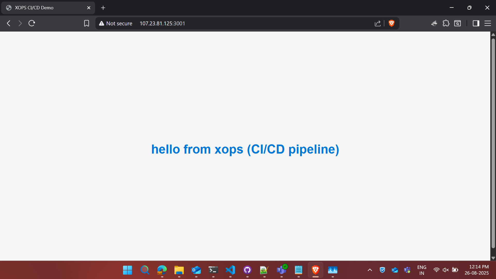

# XOPS CI/CD Demo – App2
## Project Screenshots

### Web Interface


### GitHub Actions Deployment


This repository contains **App2**, a simple Node.js HTTP server demonstrating a CI/CD deployment to AWS EC2 using **PM2**. This is part of the `nodejs_proj` project.

---

## Features

* Serves a static HTML page with linked CSS (`style.css`).
* Runs independently alongside other apps on the same EC2 instance.
* Managed using **PM2**, allowing automatic restarts and uptime monitoring.
* Configured for deployment via GitHub Actions CI/CD workflow.

---

## Project Structure

```
nodejs_proj
│
├── index.js           # Node.js entry point
├── package.json       # Node.js project manifest
├── package-lock.json
└── style.css          # CSS for your HTML page

```

---

## Prerequisites

* AWS EC2 instance (Amazon Linux / Ubuntu recommended)
* Node.js v22+ installed
* PM2 installed globally (`npm install -g pm2`)
* EC2 security group allowing **port 3001 TCP** inbound

---

## Setup & Deployment

1. **Clone project to EC2:**

```bash
cd ~
git clone <your-repo-url> nodejs_proj
cd nodejs_proj/app2
```

2. **Install dependencies:**

```bash
npm install --production
```

3. **Update server to allow external access (if not done already):**

In `index.js`:

```js
const hostname = '0.0.0.0';
const port = 3001;

server.listen(port, hostname, () => {
  console.log(`Server running at http://${hostname}:${port}/`);
});
```

4. **Start app2 with PM2:**

```bash
pm2 start index.js --name app2
pm2 save
```

5. **Verify running processes:**

```bash
pm2 ls
pm2 logs app2
```

6. **Access externally:**

```
http://<EC2_PUBLIC_IP>:3001
```

---

## CI/CD Deployment (GitHub Actions)

* The project is set up to deploy app2 automatically using GitHub Actions.
* Key points:

  * Deploys to `~/app2` on EC2
  * Installs Node.js and PM2 if not present
  * Installs dependencies and starts/restarts app2 with PM2
  * Binds server to `0.0.0.0` for public access
  * Does **not** interfere with other apps (`app`) running on different ports

---

## PM2 Management Commands

```bash
# Check all running processes
pm2 ls

# View logs for app2
pm2 logs app2

# Stop app2
pm2 stop app2

# Restart app2
pm2 restart app2

# Delete app2 from PM2
pm2 delete app2

# Save current PM2 process list (survives EC2 reboot)
pm2 save
```

---

## Notes

* Make sure **port 3001** is open in your EC2 security group for external access.
* Keep the hostname as `0.0.0.0` in `index.js` for public accessibility.
* This setup allows multiple Node.js apps to run concurrently on the same server using **different ports and PM2 process names**.
